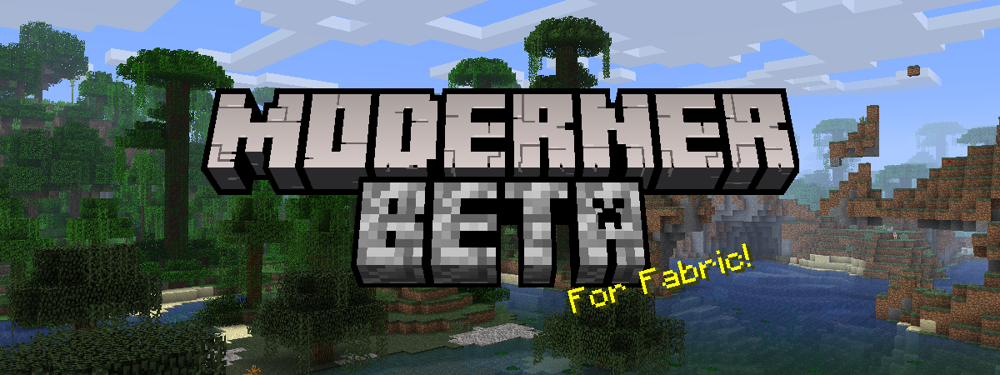

# Moderner Beta for Fabric

Moderner Beta is a fork of [b3spectacled](https://github.com/b3spectacled)'s [Modern Beta](https://github.com/b3spectacled/modern-beta-fabric). It originally started as a pull request for the original Modern Beta to add in world generation from Beta 1.8 to 1.6.4, however due to b3spectacled's inactivity it has become more of its own thing.

## Features
In addition to everything in Modern Beta...
- World generation from Beta 1.8 up to 1.6.4 with experimental support for 1.7 to 1.12.2 generation
- Fixed surface rules for Beta Vanilla and 1.12.2 presets
- Highly customisable biome layout for Beta 1.8+ versions

## Setup

* Clone project
* Edit gradle.properties, if needed
* Import the project into your preferred IDE, per https://fabricmc.net/wiki/tutorial:setup.

## License

This project is licensed under MIT, after commit 55519d1.

This project is licensed under LGPLv3, up to and including commit 55519d1.

## Credits

See credits [here](https://github.com/b3spectacled/modern-beta-fabric/wiki/Credits).
