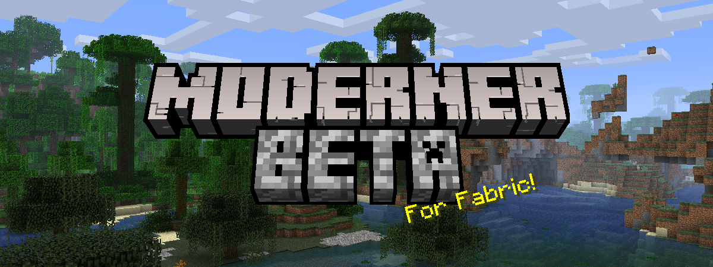

# Moderner Beta

<!-- This is horribly obsolete HTML. I can't do anything about it. -->

    

        
    

    

        <i>Part of the <a href="https://discord.gg/6fQG4AstMC">Nostalgica Reverie</a> project</i>
    

    

Moderner Beta is the successor to [b3spectacled](https://github.com/b3spectacled)'s [Modern Beta](https://github.com/b3spectacled/modern-beta-fabric).
It originally started as a pull request for the original Modern Beta to add in world generation from Beta 1.8 to 1.6.4,
however due to b3spectacled's inactivity it has become its own project.
The mod is currently supported for 1.20.1, 1.21.1, 1.21.4, 1.21.5 and 1.21.6.

## Features

What Modern Beta offered:
- World generation for various old versions of Minecraft ranging from Classic to Beta 1.7.3
- A range of custom options to modify terrain shape and biome distribution

What Moderner Beta offers:
- Support for NeoForge in addition to Fabric
- Graphical settings menu for simple options
- World generation from Beta 1.8 all the way up to Release 1.17.1 with accurate biome distribution
- Additional world generation from Infdev 20100325, Classic 0.0.14a_08 and Beta 1.1
- Experimental world generation from Bedrock Edition 1.2 and 1.17
- Re-introduced noise caves and surface rules
- Extremely customizable biome fractal layer pipeline for Beta 1.8+ versions
- A modular approach to configuration that gives greater control to addons

## Documentation

To learn about all of Moderner Beta's configuration options as well as find some answers to some frequently asked questions, go to the official wiki at https://moderner.nostalgica.net/docs.

## Setup

* Clone project
* Edit gradle.properties, if needed
* Import the project into your preferred IDE, per https://fabricmc.net/wiki/tutorial:setup.

## License

This project is licensed under MIT, after commit 55519d1.

This project is licensed under LGPLv3, up to and including commit 55519d1.

## Credits

Thanks to [icanttellyou](https://github.com/forkiesassds) for porting the mod to various platforms.

The Nintendo Switch Edition [decompilation project](https://github.com/GRAnimated/MinecraftLCE/) has been referenced to implement accurate LCE terrain generation.

In addition see Modern Beta credits [here](https://github.com/b3spectacled/modern-beta-fabric/wiki/Credits).
